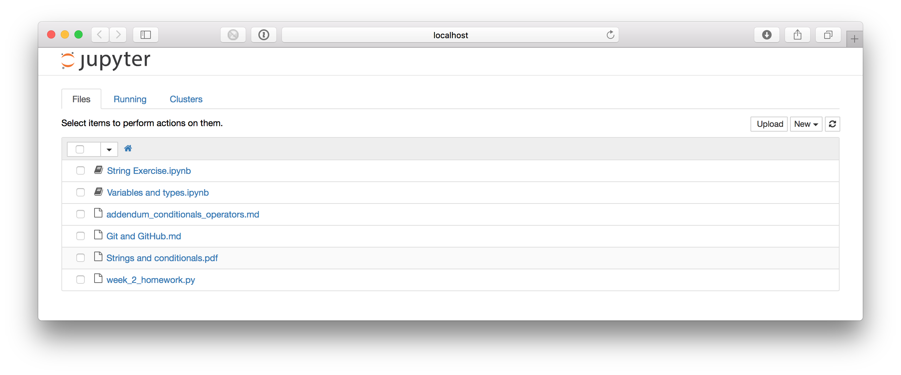

## Downloading and viewing Jupyter notebooks

If you haven't yet installed Jupyter notebook, you can do this using miniconda. To do this, simply open your terminal or command prompt and enter the command:

```
conda install jupyter
```

Jupyter should now be installed and ready to go.

The best way to view the Jupyter notebooks is to clone the CodingInPython2Day GitHub repository so that you have it on your computer hard drive.

As mentioned in class, you can do this by navigating to [CodingInPython2Day](https://github.com/SmithsonianWorkshops/CodingInPython2Day). Click on the "Clone or download" button and choose to "Download ZIP".

One you have downloaded the repo, go ahead and unzip the `.zip` file. You should be able to open the folder containing the course contents.

Now go back to your terminal window and `cd` into the `CodingInPyton2Day` directory. An easy way to do this on a mac is to type `cd` into the terminal window, then drag the directory into your terminal window. That way, it will automatically add the directory path to your terminal window. One you have navigated to the CodingInPythonDay2 repo, enter the command:

```
$ jupyter notebook
```

This will open your browser with the few items listed.



Anything with a book next to them is a Jupyter notebook that you can open. Go ahead and click on one. 

Now you have access to the Jupyter notebook!

Feel free to play around with the options and to run bits of code to see what happens.

