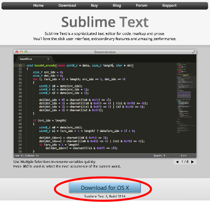
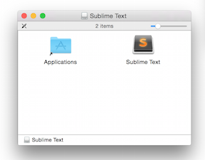

## Installing Sublime Text 3 on Mac

This guide is focused on how to install the Sublime Text 3 text editor on a Mac.

### Background

We will be using Sublime Text 3 as a code editor. Think of it as a souped-up version of TextEdit that will make writing code a lot easier.

We chose Sublime Text 3 because it is available for both Macs and Windows machines, and it will be the editor that we will be using to demonstrate in class. Other similar alternatives for Macs are [TextWrangler](http://www.barebones.com/products/textwrangler/), and [Atom](https://atom.io/).

### Install Guide

Navigate to the [Sublime Text website](http://www.sublimetext.com/). Click on the "Download for OS X" link.

It should download a file called "Sublime Text Build 3114.dmg" to your Downloads folder. When it is done downloading, double-click on this file to begin the installation process.

The installation process if very fast, and if it is successful you should see this window. Drag the Sublime Text icon into the Applications icon to complete the installation procedure.

### Sublime Text License

After several times saving files in Sublime Text, you may encounter the following dialog window:

The version we just installed is considered free for evaluation, even though all features are enabled. You can click OK to purchase a license, or you can simple click Cancel in perpetuity since this "trial" has no time limit.